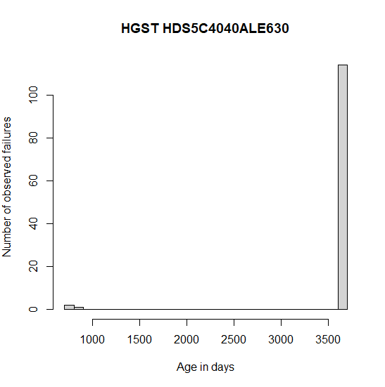

[(back to projects)](/projects.md)

# Analyzing Backblaze Drive Statistics

> Note: when I started this project, I had no background in statistics.
> I'm almost positive there will be at least one minor flaw in how I acquired my data. If you think you've found one, feel free to contact me and I'll add a disclaimer in this article.
> Since I'm not a statistician, I recommend that you don't use information obtained in this article for important things. Backblaze's quarterly reports on drives are made by actual scientists; I recommend checking those out.
> That said, I've done my best to obtain accurate data, so who knows.

Backblaze is a really interesting company. For example, here's a [complete breakdown of the Storage Pod 6.0](https://www.backblaze.com/blog/open-source-data-storage-server/), which includes a complete breakdown of the design process, as well as information on how you can build one yourself, including 3D models, a complete bill of materials, a few wiring diagrams, and a 35-page build guide that contains step-by-step instructions for assembling each part, complete with labeled pictures. Wow!
Additionally, each quarter they give a [summary report](https://www.backblaze.com/blog/backblaze-hard-drive-stats-q2-2020/) of what drives they use, how many of each have failed, and various statistics derived from those numbers.
Additionally, they have the [raw data](https://www.backblaze.com/b2/hard-drive-test-data.html) available for free so that you can reproduce that data yourself: a S.M.A.R.T. report of every drive, every single day of operation, from some time in 2013 to this very day.

I thought I'd try drawing conclusions from the raw data, and this project is exactly that. So, the data used in this project comes solely from Backblaze, and I do not own it in any way.

## Introduction

The following sections outline the questions I hope to answer, and how I hope to answer them.

### Goals

- Compare reliability of drives related to manufacturer, capacity, and model.
- Understand the relationship between various S.M.A.R.T. metrics and how they can predict drive failure.

### Assumptions

- All data provided by Backblaze is presumed to be honest and not subject to selection bias.
- Data provided by Backblaze is presumed to representative of results that would be obtained in a normal server environment; i.e., there should be no difference if I buy the drive or if Backblaze buys it
- **Drives with the same model number are presumed to perform the same way regardless of manufacturing date.**
- Drives with the same serial number from the same manufacturer with the same model number are presumed to be the same drive.

Additionally, all drives that drives that showed up in the first or second day (4-10-2013, 4-11-2013) were removed. This is because the observations would otherwise favor drives that have survived until 4-10-2013 while not considering drives that have failed prior to then. For example, if 10,000 drives of a given model were installed between 2011 and 2012, and 8,000 of them failed before 2013, the data would only show the 2,000 drives that survived. Hard drives fail according to the bathtub curve, so these 2,000 drives would likely survive a lot longer to make the bias even more exaggerated.

## First steps

To start, all of the raw data was downloaded and extracted into a folder called `raw/`. According to Windows, this folder is 49.5GB in total, but it appears to contain at least a little bit of unwanted metadata in the form of a ``__MACOSX`` folder in some directories.

I wanted to sort the information in different files corresponding to the different drive models. I wrote a small Python script to do that called `stage1.py`. In addition to doing that, it also removes drives that have existed before or during 2013-04-11 for reasons mentioned in the previous section. It writes each drive to a file of the format `models/$MODELNAME.csv` (it relies on `models/` existing in the current directory, and `raw/` containing the extracted CSVs). An annotated copy of `stage1.py` can be found [here](https://gist.github.com/dunnousername/4f3bb3d07d9e467d77d0a5e381910f1b).

Next, I wrote `stage2.py`, which takes the model CSVs and adds additional metadata, as well as converting datestamps into a single number representing the days since 2013-04-10, sort of like a Unix timestamp but measured in days and the epoch is 2013-04-10 rather than 1970-01-01. I could have implemented this in `stage1.py`, but I honestly didn't think of doing that. Instead of processing files from `raw/` into `models/`, it inputs from `models/` and outputs to `fixed_models/`. [Here's](https://gist.github.com/dunnousername/215becc90362324e279416fcafd54e2d) an annotated copy of `stage2.py`.

Finally, for analyzing reliability by itself (not considering S.M.A.R.T. stats), I wanted to try using R, a programming language that is widely used for statistics and analysis. Some of my model files are too big to load into memory at once since they contain a lot of S.M.A.R.T. data, so I made a (you guessed it) `stage3.py` that strips S.M.A.R.T. data and also includes only one entry per serial number, containing the date the drive was installed, the date it failed (or `-1` if it never did), and some other helpful variables. It inputs from `fixed_models/` and outputs to `hist/` (since it was originally for making histograms only). It can be found [here](https://gist.github.com/dunnousername/1faa5280be9ef13e5a05aaa81608ebe5) and is very similar to the other scripts.

All of the scripts listed above require `tqdm` for a nice progress bar, but have no other requirements besides a recent version of Python 3 (3.6-3.8 should be fine).

## The bittersweet truth about modern drives

Here is a plot of the observed failure rates of a somewhat-common drive from Backblaze's server. This model was chosen because it has over a hundred units and was the second entry in the dataset. If the drive is not observed to have failed, it is assumed to have died after 10 years, which is a relative generous assumption.

The vast majority of drives never failed. A handful failed initially, but very few afterwards. Modern drives are extremely reliable compared to previous generations, which is great, but it also means we can't make many meaningful observations this way since the drives are usually not old enough to observe failures due to old age.

Backblaze takes a different approach to this problem, which I plan to try to replicate. They compute a total number of drive days, and a total number of drive failures within that time frame, and calculate a per-day failure rate from that.

> I'm committed to providing an accurate, unbiased viewpoint on every article.
> If you have a suggestion, constructive criticism, or just useful feedback in general, [see here](/contact.md).

I summed up the total number of failures and divided it by the total number of drive days for each manufacturer. Then, the value was multiplied by 365.25 to represent the annualized failure rate.
The script can be found [here](https://gist.github.com/dunnousername/d196f538012770311399a2e18d6170bf).
The results are below:

|   brand | failures | drive_days |         afr |   afr (%) |
| -------:| --------:| ----------:| -----------:| ---------:|
|    hgst |      340 |   41873634 | 0.002965709 | 0.2965709 |
| hitachi |       49 |    4170801 | 0.004291082 | 0.4291082 |
| seagate |     4911 |  125203054 | 0.014326669 | 1.4326669 |
|     ssd |       11 |      81879 | 0.049069358 | 4.9069358 |
| toshiba |      154 |    2430242 | 0.023145226 | 2.3145226 |
| unknown |        1 |      31279 | 0.011677164 | 1.1677164 |
|     wdc |      369 |    4954581 | 0.027202553 | 2.7202553 |

**(to be continued)**