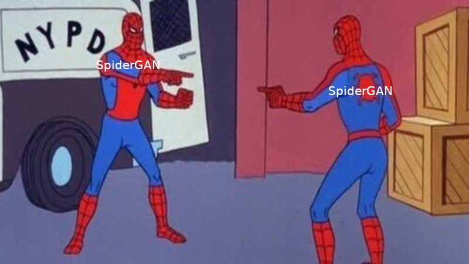
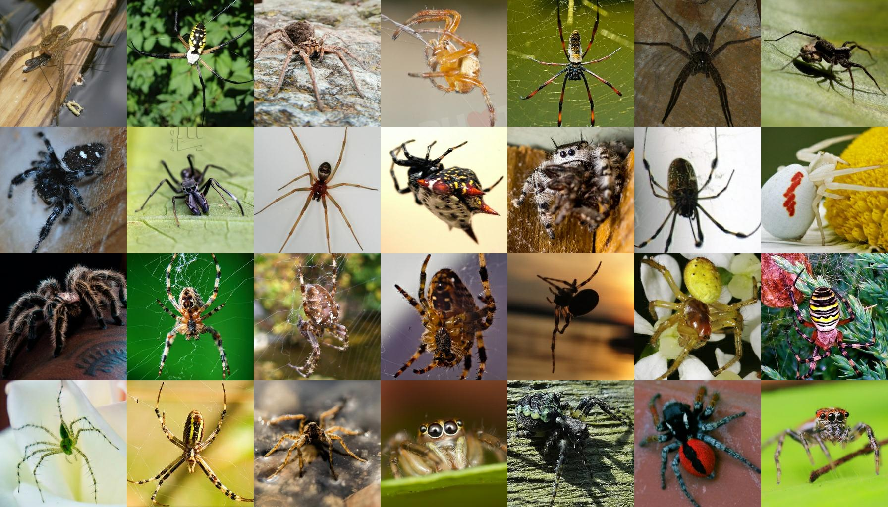

[(back to projects)](projects.md)

## This is a work in progress!

# SpiderGAN
## Introduction
I've been wanting to mess with StyleGAN(2) for a really long time now. However, I simply haven't had the time, resources or knowledge to do so.

After discovering a machine learning chatroom with a large number of StyleGAN2 users, I was more interested in StyleGAN2, and learned a lot about how it works and how to use it.
So, I decided I'd try to make a fake spider generator with StyleGAN2 in Google Colab. Here's how that went.

## First steps
Originally, I wrote a script to scrape images from the r/whatisthisbug subreddit.
The project was at this stage called BugGAN, and I assumed the subreddit dataset would be good enough.
However, after spending a lot of time trying to get that dataset to work, I eventually realized that it wasn't worth it, for several reasons:
- Most of these images are cellphone quality images of bugs where the bug makes up a very small portion of the image. There simply wasn't going to be a high enough resolution to make the project rewarding.
- The bugs from this dataset were very different from each other. There were many bugs I haven't even seen before, and I don't think an AI would be able to generalize to this concept of a "bug" without a lot of trouble.
- Because the bugs were so different, it was near impossible to draw a rigid line on what counts as a bug. This may seem easy, but if you label the entire bug, then the legs cover most of the image, which is uninteresting and could lead to issues. It isn't easy to define a "bug head" that is intuitive to both a neural network and myself.
After looking for more datasets, I was told that Flickr would be a good website to look. So, I went searching, and found [this](https://www.flickr.com/groups/spiders/): 44,000 images of spiders capture in high quality by *real* photographers.
This is where SpiderGAN really started taking shape.

> What I learned: the most obvious dataset source might not be the best. Reddit provides structured data and a convenient API, but Flickr was orders of magnitude better.

## Finding spiders
After gather all 44,000 images from Flickr using their API and [this awesome script](https://github.com/antiboredom/flickr-scrape), I set out to make a YoloV3 model using [this repo, out of fear for compiling the Darknet version](https://github.com/AntonMu/TrainYourOwnYOLO).
YoloV3 is a real-time object detection model that requires around a hundred labeled images in order to produce decent results.

Originally, I labeled 100 images, but didn't select the bounding boxes correctly. I would select the legs if they were easy to spot and weren't too big, and I'd select the "center" of the spider if the legs were too large or very thin.
This was bad because it meant that the model now thought there were two spiders; an "inner" spider, and an "outer" one. I ended up relabeling all of my data.

> What I learned: consistency in the labels of a dataset is really important, especially for object detection.

After labeling more spiders, I trained YoloV3 again. Afterwards, I "cherrypicked" it's outputs.
A good analogy for cherrypicking is giving a student several essays and then asking him/her to write a few dozen more essays that are similar to the examples.
Afterwards, you read each essay, and repeat the process, except in addition to the sample essays you had before, you also put in a few of the better-written essays that the student wrote. The network's output is filtered and reused as input.

Eventually, the model worked pretty well, and I started using it to crop images. Then, I took the cropped images, and selected the best ones to use as training for StyleGAN2.

> When the YoloV3 model provided bounding boxes around a spider, they were usually pretty good. However, it would often include a bad bounding box, sometimes more than one bad bounding box, alongside or in place of the desired bounding box.
> What I learned: under no circumstances should you blindly take the output of one AI and train another AI with it without reviewing the output first.

Originally, I took 1,217 cropped images and started training StyleGAN2. I used dvs' colab environment, which can be found [here](https://github.com/dvschultz/ai/blob/master/StyleGAN2_Augmentations.ipynb). Afterwards, I increased this to 2,000 images. I transfer-learned from the official StyleGAN2 256x256 cats config-f model, mostly since this was a 256x256 model, and not enough of my images had an effective resolution higher than that which would warrant the expense of training a larger model. On colab, I was able to train with gpu-base size of 16 images at a minibatch of 32 images, on 16GB V100 and P100 cards.

After a few days of training, at just under 2000 kimg, my results looked this:

  
<b>Click to view some fake spiders</b>

  
  
  

For comparison, here are the real ones, [courtesy of the Flickr Spiders group](https://www.flickr.com/groups/spiders/):

  
<b>Click to view some real spiders</b>

  
  
  

Notice the caterpillar-like image in the fakes. Also, a lot of the images looked similar to the reals; was that normal, or was it memorizing the inputs? There were only 2000 training images after all, and it had seen each of them nearly 1000 times. Also, it would often get confused when there were spiderwebs in the image.

Both of these issues made me reconsider my dataset. I'm currently experimenting with U^2-Net to mask off the background of the images to solve the web issue, and also to make it not waste time memorizing the background. Additionally, I might make my dataset larger. I was originally going to use 10,000 images, but 2,000 worked fine, so I decided to not worry about dataset size, but that might be more important than I thought.
